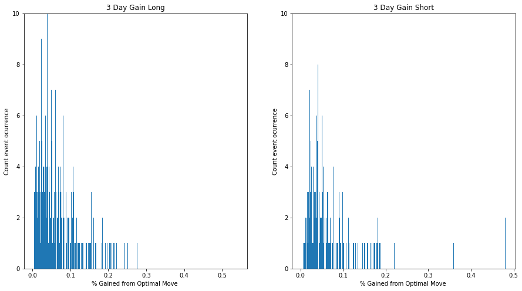

# Bitcoin Analysis

## Relevant information about the project

•	Selected topic: Bitcoin Market Analysis.

•	Reason of the selected the topic: Due to its popularity recently, this analysis will try to predict the worth of investing in this alternative option.

•	Source of the data: Dataset downloaded from Kaggle.

•	Question I hope to answer with the data:  Giving the present moment, what is the best action to be taken? (whether is a good time to sell or buy)

•	Description of the data exploration phase of the project: For the data exploration phase I created my own target variables, which was the theorical three day gain possible and I used a Histogram for analyzing the percentual frequency of gains with the daily Bitcoin price information.

•	Description of the analysis phase of the project: Significance variables were used to see which indicators were stronger in the analysis, I also tested various values of the parameters and estimators to see which ones gave optimal results. 

## Technologies Used

### Data Cleaning and Analysis
Pandas will be used to clean the data and perform an exploratory analysis. Further analysis will be completed using Python, TA and Jupyter Notebook.

### Database Storage
PostgreSQL is the database I am intending to use.

### Machine Learning
SciKitLearn is the ML library I will be using to create a classifier. My training and testing setup is train_test_split and TA library for getting the features to be used in the model.

### Dashboard
In addition to using a Flask template, I will also integrate Plotly.

## Machine Learning Model 

•	Description of preliminary data preprocessing: The dates were formatted adequately; plus, empty rows were eliminated. 

•	Description of preliminary feature engineering and preliminary feature selection, including the decision-making process: Common indicators to analyzed stocks were used, like RSI and EMA.

•	Description of how data was split into training and testing sets: I used the function train_test_split from sklearn, where 80% of the data went to the training set and 20% went to the testing set. 

•	Which model did I choose and why? Random Forest, because it is a flexible and simple to use machine model that delivers good quality results most of the time. 

•	How are you training your model? Splitting the data 80/20 to iterating over different values of the parameter number of indicators, to find which of its value optimizes the model.

•	What is the model's accuracy? 65%

https://docs.google.com/presentation/d/1XHZV6Bq3x8C4tQb6KixKTJIRPamqPALWc34JnN_c67Q/edit?usp=sharing

